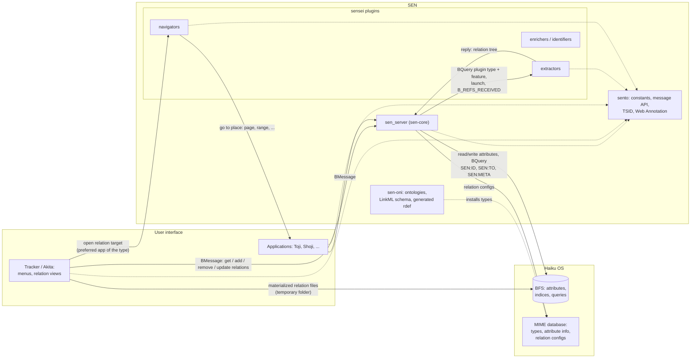
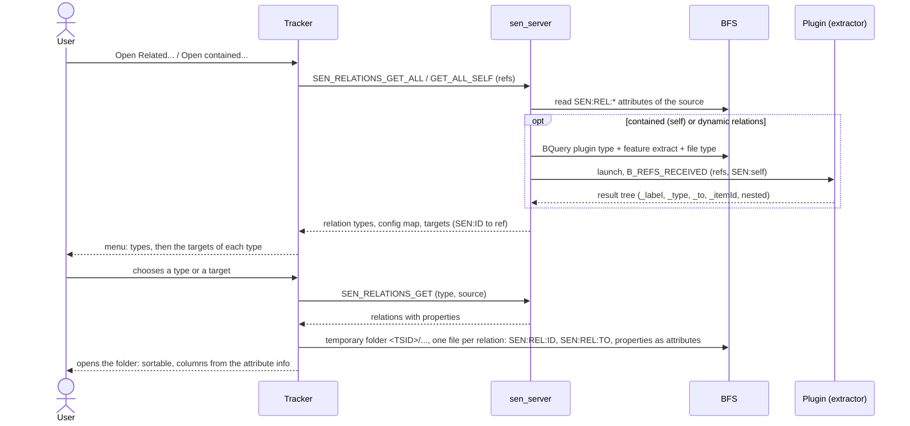

<!--
SPDX-License-Identifier: MIT
SPDX-FileCopyrightText: 2026 SEN Labs e.U.
-->
# SEN developer guide

How SEN works inside, and the rules for extending it. Written from the review of the whole code base in October 2026; where the code
does not yet follow a rule, the text says **Target** (what it will be) and **Today** (what the code does).

## 1. Principles

- **The file system is the single source of truth.** Everything SEN knows about a file is in the attributes of that file (and of
  the MIME database for types). There is no SEN database. Applications are *visitors*: they exchange state through attributes.
- **Loose coupling through messages and queries.** `sen_server` is the only process that touches relation data; Tracker/Akita,
  applications and plugins talk to it with `BMessage`s. Plugins are found at runtime with a `BQuery` for the plugin file type and
  its feature attributes: there is no plugin registry.
- **Relations are native.** A relation is a typed, labelled link between two files (entities). It is stored with the source file,
  and the other end is found by query.
- **Standards first.** Names, selectors and identifiers come from established vocabularies (Dublin Core, schema.org, W3C Web
  Annotation), see the metadata skill (`haiku-agent-skills/skills/haiku-metadata-schema`).
- No backward compatibility until 1.0.

## 2. Components

| Repo | Role |
|------|------|
| `sento` | the SEN API: headers for constants, message codes and shared helpers (this guide) |
| `sen-core` | `sen_server`: relation handling, plugin invocation, classification/config, `create-sen-indices.sh` |
| `sen-oni` | ontologies: MIME types for entities, relations and plugins as `.rdef`, installed by `oni.sh` (to be generated from a LinkML schema) |
| `sensei` | plugins: extractors, navigators, enrichers (and later identifiers) |
| `senryu` / `akita` | Tracker with SEN menus (`src/kits/tracker/*Sen*`); Akita is the later standalone fork |
| `shoji` | template-based entity editor, reads the same attributes |
| `senpai` | rule-based reasoning, later AI (not part of the release) |



## 3. The data model

### 3.1 Identity: `SEN:ID` and `SEN:TO`

These two are not relation attributes; they identify an object in the graph, and are the only attributes that must be indexed for it.
Their names are deliberately short because they exist on every linked file.

| Attribute | Type | Meaning |
|-----------|------|---------|
| `SEN:ID` | string | the file's identifier: a TSID (13 characters Crockford Base32, 42 bit ms since 2026-01-01, 10 bit machine, 12 bit counter), as an IRI `urn:sen:<tsid>`. Created on first linking. |
| `SEN:TO` | string | the `SEN:ID`s of the targets of **normal** relations of this file, comma separated. Queried as `SEN:TO == '*<id>*'` to find inbound relations. **Chunked:** BFS indexes only the first ~255 bytes of a string (verified: ids beyond about the 17th are not found), so a file holds at most 16 ids per attribute: `SEN:TO`, `SEN:TO:1`, `SEN:TO:2`, ... and an inbound query asks all indexed chunks. |
| `SEN:META` | string | Same for **meta** relations (classification *and* context, handled alike, chunked the same way). Keeps `SEN:TO` for normal relations and lets "what is labelled X" be one query. **Today** meta targets share `SEN:TO`. |

`SEN:TO` may also contain the pseudo target `_self` (the relation points to its own source), resolved when read.
Targets can be identified by `SEN:ID` (best, stable), `entry_ref` (stable on one device) or path (fragile).
Nested relations (3.3) are **not** listed in `SEN:TO`: they are resolved dynamically when their parent relation is resolved, down to a fixed depth
limit, so that the cost of a lookup stays bounded.

**Every chunk attribute must be indexed.** A query for an id asks all of them joined by `||`, and BFS silently ignores a branch without an index: measured with an id in the last chunk,
the query over `SEN:TO` ... `SEN:TO:7` found 5 files, with the indices of `:6` and `:7` removed it found 4, without an error and without being faster (`sen-core/tests/vm/perf.sh`). The
ontology creates all eight indices, the server checks them on every volume at start and on mount. The cost of the extra terms is small, because the indices of the higher chunks are nearly empty and
the time goes into the scan of the `SEN:TO` index (a wildcard on both sides cannot use the order of the index): 5,000 files, average of 20 runs:

| files | 1 attribute | 2 | 6 | 8 |
|-------|------------|---|---|---|
| realistic (96% of the files link 3 targets, 3% 20, 1% more) | 16.0 ms | 16.5 ms | 16.9 ms | 17.0 ms |
| extreme (30% of the files link more than 16 targets) | 20.3 ms | 26.7 ms | 30.9 ms | 31.4 ms |

The scan grows with the number of files that have a list (about 3 microseconds per 1,000 files and index): a graph of 100,000 linked files would need a few hundred milliseconds per lookup. If that becomes
a problem, the answer is not fewer chunks but a different lookup (e.g. a cache of the inbound ids in the server).

**Symlinks** are resolved: a symbolic link is the same object as its target, so relations of a file are found, shown and written the same way
through a link to it (traverse links when turning a path or ref into a node, before reading or creating a `SEN:ID`).

**Copies are new objects.** `sen_server` watches the volume for new entries (`B_ENTRY_CREATED`, a kernel level node monitor) and when a new entry carries a `SEN:ID` that already exists on another node,
it is a copy: its SEN attributes are removed so that it gets its own identity. Known limits of this: only the boot volume is watched; every `SEN:` attribute is removed, also content metadata
such as annotations (it should only remove identity and relation attributes: `SEN:ID`, `SEN:TO*`, `SEN:META*`, `SEN:REL:*`); the check takes the first hit of the id query; and Tracker may add the copied attributes only *after* the entry
exists, in which case the check sees no id yet (to be verified in the VM; a live query on `SEN:ID` would catch every volume and exactly the moment the attribute appears).

### 3.2 A relation

A relation type is a MIME type below `relation/` (e.g. `relation/x-vnd.sen-labs.relation.docref`), defined in an ontology.

Stored on the **source** file as **one message attribute per relation type**, `SEN:REL:<type without "relation/">`:

```
SEN:REL:x-vnd.sen-labs.relation.docref   (B_MESSAGE_TYPE)
  <targetId> = { properties of relation 1 }
  <targetId> = { properties of relation 2 }      // several relations of one type to the same target are allowed
  <otherId>  = { ... }
```

Adding an identical property set twice is a no-op (`HasSameData`). Source and target of a relation are known from the materialized file
(`SEN:REL:ID`, `SEN:REL:TO`); a single relation is therefore identified by source, type and target. Only when there are **several property sets of one type
between the same two files** (several references to different pages of one document) each of them also gets a relation id (a TSID in its property message),
added when the second set is created, so that it can be updated or deleted individually. Properties are *not* individually queryable (they are nested
in the message): to search by property, the property must be a first-class attribute of a *materialized* relation file or of the entity.

**Target:** the property that locates a place in the target (page, text range, section, time) is a W3C Web Annotation target
(`oa:hasTarget` with `oa:hasSelector`, see the WebAnnotation code in Toji, `lib/WebAnnotation.h`). The relation types
`docref`, `textref`, and others translate it into flat attributes when a relation is shown as a file (section 5).

### 3.3 Relation flavors

Defined in the ontology resource `SEN:REL:CONFIG` of the relation type, in a message with the code `SEN_RELATION_DEFINITION` (`'SCrd'`) per direction:

| Flag | Meaning |
|------|---------|
| `SEN:bidir` (default **true**) | relations are always bidirectional unless declared otherwise: SEN writes the opposite relation to the target, using `SEN:inverse` for its label and properties. |
| `SEN:dynamic` | resolved at run time (by a plugin or a query), never stored, read-only. |
| `SEN:self` | reflexive: the relation lives *inside* the source file (headings of a document, includes of a source file, files of an archive). Resolved by `extract` plugins; Tracker shows these in a separate menu (currently "Open self...", to be called **"Open contained..."**). Self relations are what allow looking *into* a file. |
| `SEN:relation` | config of the forward direction (label, ...) |
| `SEN:inverse` | config of the opposite direction (label, ...) |

Directions: outbound relations are stored on the source; inbound ones are found by query (`SEN:TO`), or, for bidirectional relations,
exist as an explicitly written opposite relation. **There is no separate direction flag**; what to show is decided by `bidir`, `self`, `dynamic`.

### 3.4 Meta relations: classification and context

Classification (labels, topics, collections, concepts) and context (a project, domain or life area, `SEN:CTX`) are modelled as relations of
the type `relation/x-vnd.sen-labs.relation.association` to special entities of the `classification/` supertype. They are **unidirectional**
(`SEN:bidir = false`): a label file would otherwise hold a link to every labelled file. The inverse ("what has this label") is resolved by
reverse query, except for links between two classification entities, which stay bidirectional. Handled in code, see
`GetCompatibleTargetTypes` and `SEN_ASSOC_RELATION_TYPE`. Contexts bind files to a global context. **Target:** `SEN:META` as described in 3.1, one handling for classification and
context, kept separate from normal relations. Association works; the context part is unfinished and must be completed.

### 3.5 Entities

Entities are files whose MIME type is below `entity/` (Book, Movie, Person, ...). Their attributes follow the naming rules below, with
established names (`dc:`, `schema:`, `foaf:`) wherever they exist: **no attributes invented per file type**.

## 4. Names: three layers, three conventions

Names serve different purposes and are therefore written differently.

| Layer | Convention | Examples |
|-------|-----------|----------|
| **File attribute** | `<prefix>:<name>`; established vocabulary first (`dc:`, `dcterms:`, `schema:`, `foaf:`, `oa:`, `be:`), else `SEN:`. Short names for what exists on every file (`SEN:ID`, `SEN:TO`, `SEN:META`). Relation data below `SEN:REL:`. Application state in one message attribute `<app>:viewState`. | `dc:title`, `schema:isbn`, `SEN:annotations`, `SEN:REL:x-vnd.sen-labs.relation.docref` |
| **Message field** (BMessage key) | `SEN:camelCase` for SEN protocol fields; Haiku conventions kept (`refs`); Web Annotation structures use their compact IRIs. `what` codes are four character codes. | `SEN:relationType`, `oa:hasTarget`, `'SRad'` |
| **Constant in code** | one name for each string used in more than one place; no literals. `inline constexpr` in namespaces, `k` prefix (like Toji's `WebAnnotation`): `sen::attr::kId`, `sen::key::kRelationType`, `sen::cmd::kRelationAdd`; for plugins `sensei::`. | |

Types: dates `B_TIME_TYPE`, counts `B_INT32_TYPE`, structured data a flattened `B_MESSAGE_TYPE`. Define attributes on the MIME type
(`META:ATTR_INFO`, with translated public names) so Tracker shows them as columns; make an index per volume only for what is queried
(`create-sen-indices.sh`). Only the **first** predicate of a query needs an index.

`META:TYPE` is the **semantic** type of a file (e.g. `document/scientific-paper`), set by `identify` plugins; Haiku itself only knows the
technical MIME type (`application/pdf`). Do not use it for anything else.

### 4.1 Messages and replies

Requests are messages with a `what` code (`sen::cmd::...`) and SEN keys. Every reply carries the same three fields, whatever the request:

| Field | Type | Meaning |
|-------|------|---------|
| `status` | int32 | SEN status code, telling like an HTTP status (200 ok, 201 created, 204 nothing to return, 400 bad request, 404 not found, 409 conflict, 500 failed, 503 unavailable); the technical `status_t` of a failed Haiku call goes into `detail`, not the code |
| `detail` | string | text that says what happened, for people and logs |
| `apiVersion` | int32 | version of the SEN API of the server, so that clients can check what they talk to |

These three envelope keys are the exception to the `SEN:` prefix rule: they are protocol level and read like `refs`.
Operations that change several attributes (add, update, remove a relation) are transactional: they either complete or leave nothing half done
(the order of writes is made so that a repeat completes it, and `SEN_CORE_CHECK` repairs what a crash left).
A request is never blocked by another one: the server works plugin calls and long queries in worker threads with a timeout.

## 5. Relations as views: materialized relations

A menu in BeOS and Haiku is a possible view: clicking a folder in a menu opens that folder in Tracker. SEN extends this to relations.
"Open Related..." lists the relation types of a file, each type expands to its targets, and choosing one opens a **folder that shows the
relation as files**, the same way as a folder menu opens a folder. Nobody has to learn a new kind of window: it is a view on a more
abstract level, like a database view, but for the user it is a folder, only a dynamic one.

Because the relations are shown as ordinary files, everything Tracker knows about files works for them. The relation properties are
file attributes, so a list of document references can be sorted by page or chapter, a list of quotes by position, and each property
is a column that the relation type defines (`META:ATTR_INFO` of its MIME type).



How it is built:

1. Tracker asks `sen_server` for the relations of the selected files (`SEN_RELATIONS_GET_ALL`, `..._GET_SELF`, `..._GET_COMPATIBLE`). The reply lists the relation types, a config map
   and the targets, which the menu shows per type.
2. On a menu choice `TTracker::PrepareRelationFolder` / `PrepareRelationTargetFolder` create a temporary folder
   (`TrackerSenRelations::CreateRelationDirectory`) of the relation's MIME type, marked `META:TYPE = application/x-vnd.sen-labs.sen-relation-folder`,
   which carries the identity of the real source in `SEN:REL:ID`.
3. `WriteTargetRelations` creates one file per relation (a **directory** for relations that have nested relations), named after the relation label (`#n` appended when not unique), typed with the relation type,
   with `SEN:REL:ID` (source), `SEN:REL:TO` (target), the refs, and **every property as an attribute**; name and type of each come from the attribute info of the relation type. Properties starting with `_` are internal.
4. Dynamic relations are created read-only; static ones are writable.

**Nested relations** model n-ary relations: a relation can carry nested relation messages, which are shown as a sub folder. A relation between
an Author and a Book can have a Reader relation attached. The same code that writes the self relation tree writes these.

**The temporary folder must be unique.** Today it is `<temp>/sen/<inode of source>/<type>/`, and an inode is only unique on one volume while the temp folder is shared by all of them.
**Target:** the folder is named after a fresh TSID per view (a `SEN:ID` that lives as long as the view), `<temp>/sen/<tsid>/<type>/`, and the real source is named by the `SEN:REL:ID` attribute (and the
source ref where the source has no `SEN:ID`, as with dynamic relations). A fresh id per view also means that two views of the same file do not overwrite each other, which `CreateRelationDirectory` does today
(it removes an existing folder first), and that merely browsing never writes a `SEN:ID` to a file.

### 5.1 Editing relations by working with the files (target, last work package)

Today the view is read-only in effect: deleting or editing a file does nothing to the real relation, `RemoveRelation` / `RemoveAllRelations` in
`sen_server` are stubs, and there is no update command. The target is that the usual file operations *are* the relation operations (a relation file whose target is gone is shown with the "broken link" icon, and deleting it removes the dangling relation):

| User does in a relation view | Relation does |
|------------------------------|---------------|
| drops a file into a **target folder** of a type | **create**: a new relation of that type to the dropped file (`SEN_RELATION_ADD`) |
| drops a file into the **top level** (relation types only) | creates a generic relation (`relation/x-vnd.sen-labs.relation.reference`) to the file |
| deletes a relation file | **delete** (`SEN_RELATION_REMOVE`), including the opposite side of a bidirectional one |
| edits an attribute of a relation file | **update** the property (new `SEN_RELATION_UPDATE`) |
| moves a relation file to another target folder | **update**: the relation gets the other target (or type) |

```mermaid
sequenceDiagram
  actor User
  participant Tracker
  participant Server as sen_server
  participant BFS
  Note over User,BFS: create
  User->>Tracker: drops a file into a relation target folder
  Tracker->>Server: SEN_RELATION_ADD (source, type, target)
  Server->>BFS: SEN:REL:type, SEN:TO or SEN:META, inverse side if bidirectional
  Server-->>Tracker: status, detail
  Note right of Tracker: dropped on the top level (relation types only): a generic reference relation
  Note over User,BFS: update
  User->>Tracker: edits an attribute of a relation file (B_ATTR_CHANGED)
  Tracker->>Server: SEN_RELATION_UPDATE (source, type, target, new properties)
  Server->>BFS: replace the property set (and the inverse's)
  User->>Tracker: moves a relation file to another target folder
  Tracker->>Server: SEN_RELATION_UPDATE (new target / type)
  Note over User,BFS: delete
  User->>Tracker: deletes a relation file (B_ENTRY_REMOVED)
  Tracker->>Server: SEN_RELATION_REMOVE (source, type, target)
  Server->>BFS: remove the property set; when none is left: SEN:TO / SEN:META entry and the inverse side
  Note over Tracker,Server: dynamic relations are read-only, nothing is watched
```

Needed for this: the identity of each single relation (source, type and target, plus the relation id where several property sets exist, see 3.2; both are attributes of the
relation file); one shared function that translates the attributes of a file back into the property message (and the Web Annotation selector) and the other way round; Tracker watching only the
relation folders it created, never dynamic ones. A rename is not an edit of the relation (the file name is derived from the label); editing the label attribute is.

## 6. Plugins (SENSEI)

A plugin is a Haiku application with `B_MULTIPLE_LAUNCH | B_BACKGROUND_APP` and these resources:

- the plugin type `application/x-vnd.sen-labs.plugin` (as the attribute `META:TYPE`, the semantic type).
- feature flags, one int32 attribute per feature, prefix `SEN:plugin` (`sensei::kFeatureAttrPrefix`): `SEN:plugin:extract`, `:enrich`, `:identify`, `:navigate` (and `search`). The flags are not indexed (BFS cannot index 16 bit values at all, so keep them 32 bit); a query needs only one indexed attribute, so the plugin type `META:TYPE` comes first.
- `file_types`: the MIME types it can handle.
- optional `SEN:type_mapping` (short alias to relation type, `SEN:default` is the default type) and `SEN:attr_mapping` (short property key to attribute name): they only keep messages small.

The server finds plugins with a `BQuery` for the plugin type (`META:TYPE`, indexed) on **all mounted volumes** (`sen::QueryAllVolumes`), with the feature flag in the same predicate, and checks the supported file type, every time (`sen::FindPlugins`, `GetPluginsForTypeAndFeature`).

### Extractors look *inside* a file, and return normal and contained relations

An extractor reads a file's content and may find **both** kinds of relation:
- *normal* (outgoing) relations to other files: the `#include`s of a source file, the links of a document;
- *contained* (`SEN:self`) relations to parts of the same file: the outline of a document, the declarations of a source file.

The request says which is wanted: `SEN:self = true` asks for the contained ones, otherwise the outgoing ones. A plugin has to read that flag
and answer only that. The relation type of each returned item says what it is. When the server lists contained relations it takes the relation types of the plugins' type mappings
and keeps those whose relation config has `SEN:self` (**Today** it lists all of them; outgoing relations from extractors are not implemented yet).

```mermaid
sequenceDiagram
  participant Server as sen_server (RelationHandler)
  participant BFS
  participant Plugin as Plugin (B_MULTIPLE_LAUNCH)
  participant Collector as Reply collector (looper owned by the server)
  Server->>BFS: BQuery type=plugin, SEN:plugin:extract=1, file_types match
  BFS-->>Server: plugin ref(s), type_mapping, attr_mapping
  Server->>Plugin: be_roster->Launch(signature), remembers the team
  Server->>Collector: create, Run()
  Server->>Plugin: B_REFS_RECEIVED (refs, SEN:self = true or false), reply to Collector
  Plugin->>Plugin: read the file, build the relation tree
  Plugin-->>Collector: SENSEI_MESSAGE_RESULT (result, items)
  Collector-->>Server: reply (semaphore; fails if the team is gone)
  Server->>Server: map aliases (type_mapping, attr_mapping), _to/_item to SEN names, unique item ids
  Plugin->>Plugin: quits
```

This is what `ResolveSelfRelationsWithPlugin` does (the name says self, the mechanism is the same for both):
1. the server launches the plugin (`be_roster->Launch`) and remembers its team: a second instance must not be addressed by signature alone;
2. it sends `B_REFS_RECEIVED` with `refs` and the flag, and a reply target owned by the server (a looper that collects the reply);
3. the plugin replies with `sensei::cmd::kResult` and a tree of items; each level has parallel fields `_label`, `_type`, `_to`, `_itemId` (arrays of equal length), with nested levels under `_item` / `SEN:relations`.
   **This format is deliberate:** a BMessage collects same-named fields into one array per name, so a flat list of entries would lose the order between different names. The parallel arrays with one `_item` message per entry keep the order of the
   entries (and so the order of the bookmarks of a PDF in the Tracker menu) and their nesting. Do not flatten it;
4. the server maps the aliases and `_to`/`_item` to the real names (`TransformPluginResult`), adds a unique id to each node and returns the result.

Rules for plugins: use the shared constants, never literals; a plugin writes no files itself.

## 7. Code conventions

- C++20; native Haiku API at the boundary (BMessage, BNode, BQuery, BEntry), the standard library for internal logic.
- `#pragma once`, never header guards.
- Doxygen Javadoc comments: `/** @brief ... @param ... @return ... */`. Comments say why, not what.
- File header (every source, script and resource file):
  `SPDX-License-Identifier: MIT` and `SPDX-FileCopyrightText: <years> SEN Labs e.U.`
- Logging: `spdlog` (HaikuPorts `spdlog_devel`, links `spdlog` and `fmt`, defines `SPDLOG_COMPILED_LIB SPDLOG_FMT_EXTERNAL`) in all SEN code except the Tracker, which is part of the Haiku tree and logs with the platform's macros (`PRINT()` for traces, `ERROR()` from `TrackerSenLog.h`, which writes to the system log); no `printf`/`fprintf` logging and no macros in public headers. Sinks and levels are configuration, not code: `sen_server` reads `SEN_LOG_LEVEL` (`trace`..`off`).
- Do not touch legacy attributes of other programs (`META:*` of People, `bepdf:*`); new ones are written beside them.
- Tests run in CI. Logic that needs no BeAPI is tested on Linux; attribute, query and message behaviour runs in a Haiku VM
  (see `haiku-agent-skills/skills/haiku-vm-workflow`).

## 8. Ontologies and the generator

The types of SEN (entities, relations, classification, plugins) are described as [LinkML](https://linkml.io) schemas in `sen-oni/schema/`. A generator
(`sen-oni/generator/oni_gen.py`, see its README) writes from them the Haiku resource definitions, the manifests and a C++ header per ontology
(`SenOnto<Name>.h`, namespace `sen::onto::<name>`, with the attribute names, MIME types and the list of indices). Code uses these constants, never string
literals of attribute names; the constants of the core API (`SenAttributes.h`, ...) stay hand written, and a test compares them with the schema.

- **One attribute name, one type.** The generator refuses a schema that defines an attribute twice with a different type or index flag.
- **Shared vocabulary for properties.** Relation properties use the same attribute names as the entities and as Toji (`schema:pageStart`, `oa:start`, `be:line`), so
  columns and queries work across relation types.
- **Indices** are created by the ontology installer (`sen-oni/bin/mime`) and by the SEN server (at start and when a volume is mounted) on every mounted volume that supports
  them; an index is never removed (attribute names are shared with other programs). BFS indexes only the first 255 bytes of a string and no 16 bit values.
- **Tests:** `python3 -m unittest discover -s sen-oni/tests` (also in CI) checks the generator, that the committed files are up to date, and that `sento` and `sensei` agree with the schema;
  `sento/tests` runs the TSID tests on Linux, macOS and Haiku; `sen-core/tests/vm/run.sh` is the end-to-end test in the Haiku VM.

